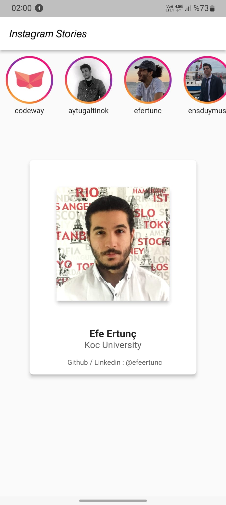
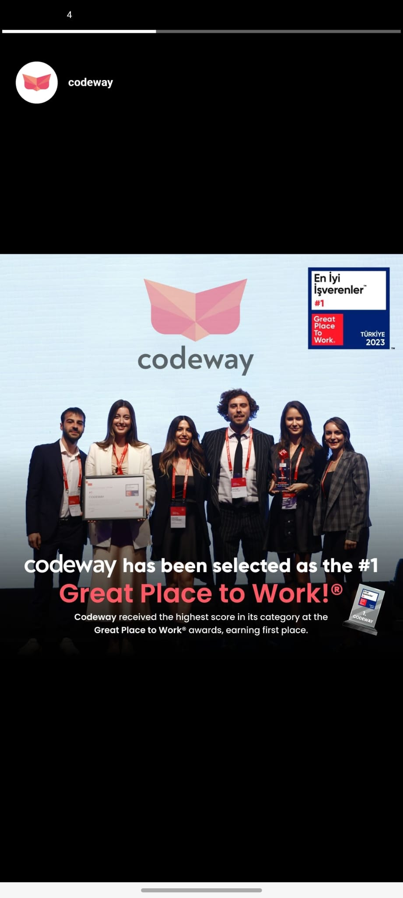

# Instagram Stories (Codeway case)

  
   
  Demo Video

  
  
  

## Overview

- The application starts by initializing Firebase and setting up a `MultiBlocProvider` in the `main.dart` file. This `BlocProvider` is used to provide instances of the **StoryViewModel** to the widget tree.

- The **MyApp** widget, which is the root widget of the application, uses the **ResponsiveSizer** widget to handle responsive layout and the **MyHomePage** widget as its home widget.

- The **MyHomePage** widget contains a scaffold that provides a basic visual structure for the application. Inside the scaffold, there is a **StoryAvatar** widget that is used to display the story avatars.

- The **StoryAvatar** widget uses the **StoryViewModel** to fetch stories from the Firebase Firestore database. The stories are displayed in a horizontal list. When a user taps on an avatar, the **MainView** widget is pushed onto the navigation stack to display the main content of the application.

- The **StoryViewModel** uses the **StoryRepository** to fetch stories from Firebase Firestore. The fetched data is then emitted to the **StoryAvatar** widget through the Bloc pattern.

- The **Story** model represents a single story, containing fields for `profileUrl`, `userId`, `username`, and `stories` (which is a list of URLs for individual story images).

- The **AnimatedBar** widget seems to be used to display a progress bar that indicates how much of a story has been viewed. The progress bar is animated and updates based on the user's viewing progress.

